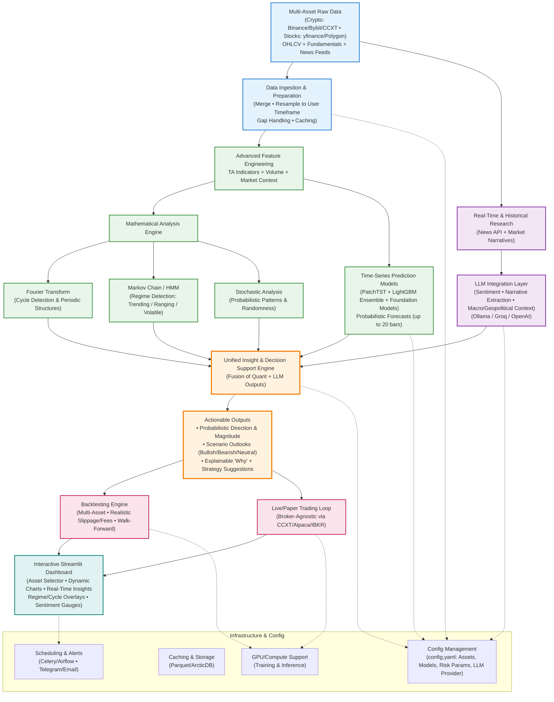

# Hybrid Trader

**AI-Powered Hybrid Cryptocurrency Trading System for BTC/USDT (5-minute timeframe)**

A modular, production-ready framework that combines **classical machine learning**, **transformer-based deep learning**, and **foundation model forecasts** to generate trading signals, backtest strategies, and run live automated trading on Bybit.


## ✨ Features

- **Multi-exchange data pipeline** — Binance + Bybit OHLCV fetching, merging, and resampling
- **Rich feature engineering** — Technical indicators, volume features, market regime detection (trending / ranging), and foundation model predictions as features
- **Hybrid modeling**:
  - LightGBM (fast, interpretable, used in dashboard & backtesting)
  - PatchTST (Transformer with patching — state-of-the-art for time series)
  - Support for foundation models (TimeFM, Chronos, TimeGPT) as features or zero-shot forecasters
- **Backtesting engine** with realistic TP/SL and equity curve visualization
- **Live trading loop** with Bybit API integration, normalization, and signal generation
- **Interactive Streamlit dashboard** for signal visualization and strategy testing
- GPU-ready training scripts

## 🏗️ Architecture


    
Core Idea: Use PatchTST for the live forecasting engine and LightGBM for quick iteration and explainability. Foundation models enrich features or serve as experimental baselines.
📁 Project Structure

- 📁 hybrid_trader
  - 📄 .gitignore
  - 📄 bootstrap_gpu.sh
  - 📄 filetree.txt
  - 📄 launch_patchtst.sh
  - 📄 predictions.png
  - 📄 prepare_data.sh
  - 📄 price_vs_prediction2.png
  - 📄 qwen.html
  - 📄 README.md
  - 📄 requirements.txt
  - 📁 src
  - 📄 app_dashboard.py
  - 📄 test.py
  - 📁 analysis
    - 📄 visualize_predictions.py
    - 📄 visualize_price_vs_prediction.py
  - 📁 backtest
    - 📄 backtester.py
  - 📁 data_fetch
    - 📄 binance_ohlcv.py
    - 📄 build_data.py
    - 📄 bybit_ohlcv.py
    - 📄 enhanced_data_collector.py
  - 📁 features
    - 📄 build_features.py
    - 📄 ta_regime_features.py
  - 📁 live
    - 📄 api.py
    - 📄 live_loop.py
    - 📄 OLDruntime.py
    - 📄 runtime.py
  - 📁 train
    - 📄 train_enhanced_patchtst.py
    - 📄 train_model.py
    - 📄 train_patchtst.py
  - 📁 utils
- 📄 binance_archive_fetch.py
- 📄 device.py
- 📄 parquet_merge.py
- 📄 patchtst_dataset.py
- 📄 prepare_patchtst_dataset.py
- 📄 resample_5m.py

🚀 Quick Start
1. Clone the repository
Bashgit clone https://github.com/Ziggy00781/hybrid_trader.git
cd hybrid_trader
2. Install dependencies
```bash pip install -r requirements.txt ```
3. (Optional) GPU Environment Setup
```bash bootstrap_gpu.sh ```
4. Prepare Data
```bash prepare_data.sh ```
This script handles fetching, merging, resampling, and feature engineering.
5. Train Models (if needed)
```bash
# Train PatchTST
bash launch_patchtst.sh
```

# Or run specific training scripts
```bash python -m src.train.train_patchtst
python -m src.train.train_model      # for LightGBM
```
6. Run the Dashboard
```bash 
python streamlit run src/app_dashboard.py
```
7. Run Live Trading (Paper or Real)
```bash
# Review and set your Bybit API keys in src/live/api.py or config
python -m src.live.runtime
# or use live_loop.py for continuous operation
```
⚠️ Warning: Live trading involves real financial risk. Start with paper trading and small position sizes.

### 📊 How It Works

Data → Multi-exchange 5m BTC/USDT candles
Features → Classical TA + regime detection + foundation model forecasts as extra signals
Models:
LightGBM: Predicts probability of upward move → filtered by regime
PatchTST: Predicts next 5m return directly → converted to trading signal

Signals → Threshold-based (e.g., strong long if predicted return > 0.05%)
Execution → Backtester or live loop with position management

### 🛠️ Configuration & Customization

Model paths and thresholds are currently in the respective scripts (future improvement: centralized config/ with YAML).
Feature sets can be extended in src/features/ta_regime_features.py.
Backtest parameters (TP/SL, thresholds) are adjustable in the Streamlit sidebar.

### 📈 Results & Visualization
The repository includes example charts:

price_vs_prediction.png — Actual price vs model predictions
predictions.png — Raw forecast visualization

### 📋 Roadmap

 Centralized configuration (config.yaml)
 Ensemble model (PatchTST + LightGBM)
 Advanced risk management & position sizing
 Telegram / Discord alerts
 Walk-forward optimization
 Docker + GitHub Actions CI/CD
 Multi-asset & multi-timeframe support
 Proper unit tests

### ⚠️ Disclaimer
* This project is for educational and research purposes only.
No guarantee of profitability. Past performance does not indicate future results.
Trading cryptocurrencies involves substantial risk of loss. Use at your own risk.
Always backtest thoroughly and start with simulated trading. *
### 🤝 Contributing
Contributions are welcome! Feel free to open issues or pull requests for:

Bug fixes
New features
Improved documentation
Better risk management

### 📄 License
This project is licensed under the MIT License — see the LICENSE file for details (add one if you want).

### Made with ❤️ in Hawaii by Ziad (Ziggy00781)
Questions or ideas? Open an issue or reach out!

### Donations accepted!
Bitcoin Address: bc1qgxhaqx96t2esdj73qdkx6un5wun48jxs62ndfu